# 🍽️ Foodie

음식을 좋아하는 사람들이 음식에 관해 소통하는 SNS<br/>

<br/>

## 1. 제작 기간 & 참여 인원

- 2024년 5월 3일 ~ 2024년 8월 21일
- 개인 프로젝트

<br/>

## 2. 사용 기술

- Java 17
- Spring Boot 3.2.5
- Gradle 8.7
- Spring Data JPA
- Querydsl
- MySQL
- H2
- Spring Security
- Spring Web
- Spring Data Redis
- Spring Kafka
- Spring Actuator / Prometheus / Grafana
- WebSocket
- Docker
- Google Cloud Platform

<br/>

## 3. ERD

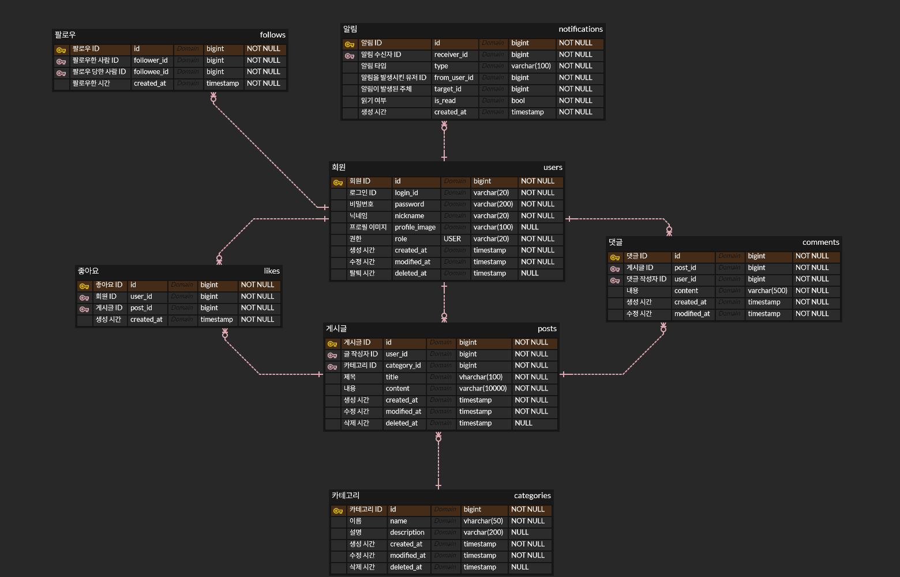

<br/>

## 4. 전체 구조

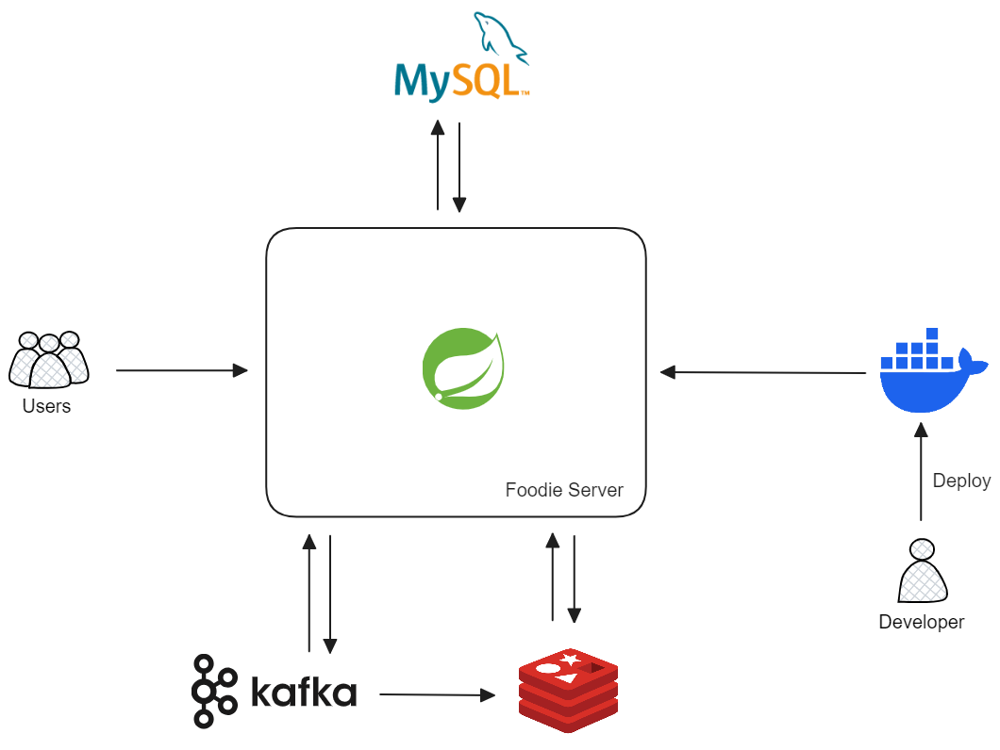

<br/>

## 5. 기능

### 5.1. 전체 기능

- 유저
  - 회원가입, 로그인/로그아웃, 아이디 중복/닉네임 중복 체크
  - 비밀번호 변경, 정보 수정
  - 본인 정보/다른 사용자 정보 조회
  - 프로필 사진 업로드/삭제/조회
  - 탈퇴
- 게시글
  - 피드(팔로우한 사용자 게시글) 조회
  - 좋아요한 게시글 목록 조회
  - 내가 작성한 게시글 목록/다른 사용자가 작성한 게시글 목록 조회
  - 게시글 검색: 제목, 작성자 로그인 아이디
  - 게시글 작성/수정/삭제/조회/목록 조회
  - 게시글 좋아요/좋아요 취소
- 댓글
  - 댓글 작성/수정/삭제/목록 조회
- 팔로우
  - 팔로워 목록 조회
  - 다른 사용자 팔로우/언팔로우
- 알림
  - 알림 구독
  - 알림 목록 조회
- 채팅
  - 채팅방 목록/상세 조회
  - 채팅방 생성

<br/>

### 5.2. 핵심 기능

- 이 서비스는 SNS이기 때문에 게시글 조회, 알림이 핵심 기능입니다.
  - 전체 게시글 목록을 조회할 수 있습니다.
  - 피드(팔로우한 사용자의 게시글)를 조회할 수 있습니다.
  - SSE를 이용해 실시간으로 알림을 전송합니다.

<details>
<summary><b>게시글 목록 조회</b></summary>
<div markdown="1">

<br/>

**Controller**

📌 [코드 확인](https://github.com/hbeeni/foodie-server/blob/a5ef93f0bb4f2db668bf56c8f6477c222a582b31/src/main/java/com/been/foodieserver/controller/PostController.java#L37)

- **요청 처리**

  - 페이징에 필요한 페이지 번호, 페이지 사이즈를 요청으로 받습니다.

    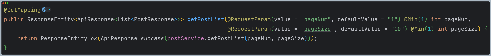

<br/>

**Service**

📌 [코드 확인](https://github.com/hbeeni/foodie-server/blob/a5ef93f0bb4f2db668bf56c8f6477c222a582b31/src/main/java/com/been/foodieserver/service/PostService.java#L49)

- **Repository 호출**

  - Redis에 접근하기 위해 Repository를 호출합니다.

  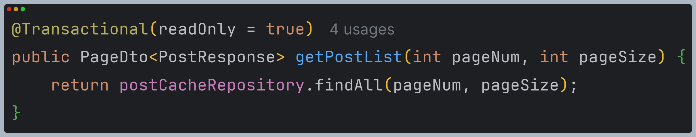

<br/>

**Repository**

📌 [코드 확인](https://github.com/hbeeni/foodie-server/blob/a5ef93f0bb4f2db668bf56c8f6477c222a582b31/src/main/java/com/been/foodieserver/repository/cache/PostCacheRepository.java#L42)

  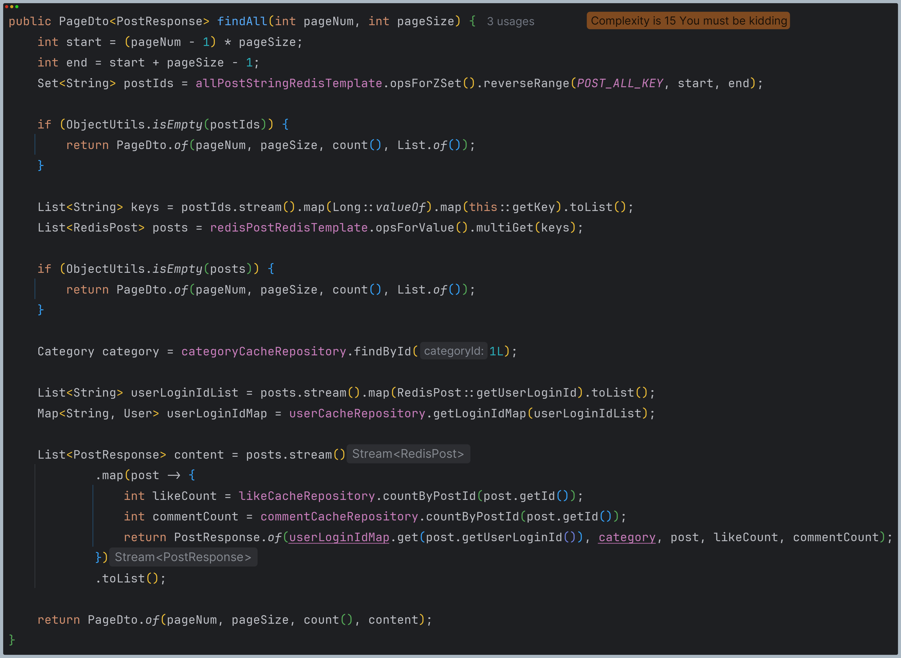

  <br/>

1. Redis에 Sorted Set으로 저장된 게시글 ID(`post:all`)를 시간 역순으로 정렬해 가져옵니다.
   

2. 게시글은 Redis에 `post:{id}` key 형식으로 저장되어 있습니다. 1번에서 가져온 ID를 key 형식으로 변환해 게시글을 가져옵니다.
   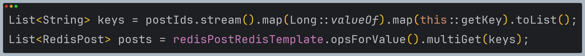

3. Redis에서 게시글 응답에 필요한 카테고리, 유저, 좋아요 개수, 댓글 개수 정보를 가져와 응답 객체를 만들어 반환합니다.
   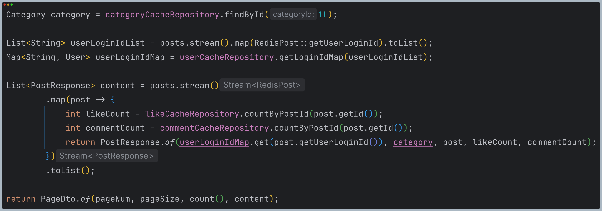

</div>
</details>

<details>
<summary><b>피드 조회</b></summary>
<div markdown="1">

<br/>

**Controller**

📌 [코드 확인](https://github.com/hbeeni/foodie-server/blob/a5ef93f0bb4f2db668bf56c8f6477c222a582b31/src/main/java/com/been/foodieserver/controller/PostController.java#L57)

- **요청 처리**

  - 팔로우한 유저 정보가 필요하므로 로그인한 유저 정보를 받습니다.
  - 페이징에 필요한 페이지 번호, 페이지 사이즈를 요청으로 받습니다.

    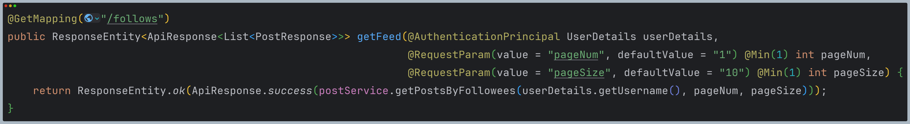

<br/>

**Service**

📌 [코드 확인](https://github.com/hbeeni/foodie-server/blob/a5ef93f0bb4f2db668bf56c8f6477c222a582b31/src/main/java/com/been/foodieserver/service/PostService.java#L73)

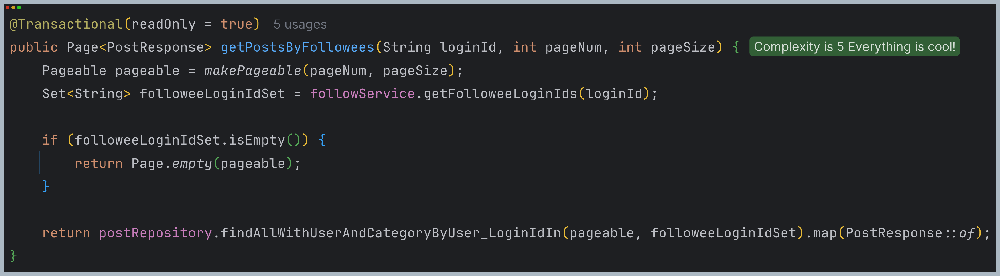

<br/>

- **팔로우한 유저 ID 가져오기** 📌 [코드 확인](https://github.com/hbeeni/foodie-server/blob/a5ef93f0bb4f2db668bf56c8f6477c222a582b31/src/main/java/com/been/foodieserver/service/FollowService.java#L82)

  - 로그인한 유저가 팔로우한 유저의 ID를 가져옵니다.
  - Follow 엔티티를 Stream을 사용해 Followee ID Set으로 변환합니다.

  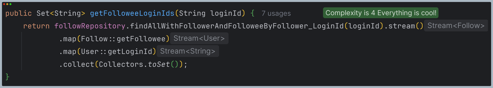

<br/>

- **Repository 호출**

  - DB에 접근해 게시글을 가져옵니다.

<br/>

**Repository**

📌 [코드 확인](https://github.com/hbeeni/foodie-server/blob/a5ef93f0bb4f2db668bf56c8f6477c222a582b31/src/main/java/com/been/foodieserver/repository/PostRepository.java#L33)

  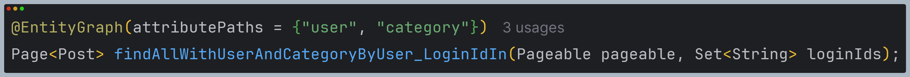

- `@EntityGraph`를 사용해 유저, 카테고리 정보를 fetch join 해서 게시글을 가져옵니다.

</div>
</details>

<details>
<summary><b>알림</b></summary>
<div markdown="1">

<br/>

- 아래 3가지 경우에 알림을 전송합니다.
  1. 누군가 게시글에 좋아요를 누를 때
  2. 누군가 나를 팔로우 할 때
  3. 게시글에 댓글이 달릴 때
- 코드 흐름은 동일하기 때문에 게시글에 좋아요를 누르는 경우로 설명하겠습니다.

<br/>

### 알림 구독: SSE

알림은 클라이언트의 요청 없이도 실시간으로 서버의 변경 사항을 갱신해줘야 하기 때문에 SSE 기술을 사용하였습니다.

1. 클라이언트에서 서버쪽으로 특정 이벤트를 구독함을 알려줍니다. (SSE Connection을 맺습니다다.)
2. 서버에서는 해당 이벤트가 발생하면 클라이언트쪽으로 이벤트를 보내줍니다.

<br/>

**Controller**

- **SSE Connection 요청** 📌 [코드 확인](https://github.com/hbeeni/foodie-server/blob/a5ef93f0bb4f2db668bf56c8f6477c222a582b31/src/main/java/com/been/foodieserver/controller/NotificationController.java#L38)

  - 클라이언트에서 이벤트를 구독함을 알립니다.
  - 클라이언트가 요청하는 HTTP Header의 accept는 text/event-stream이어야 합니다.

    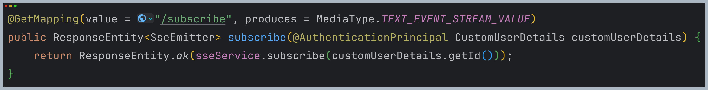

<br/>

**Service & Repository**

📌 [코드 확인](https://github.com/hbeeni/foodie-server/blob/a5ef93f0bb4f2db668bf56c8f6477c222a582b31/src/main/java/com/been/foodieserver/service/SseService.java#L43)

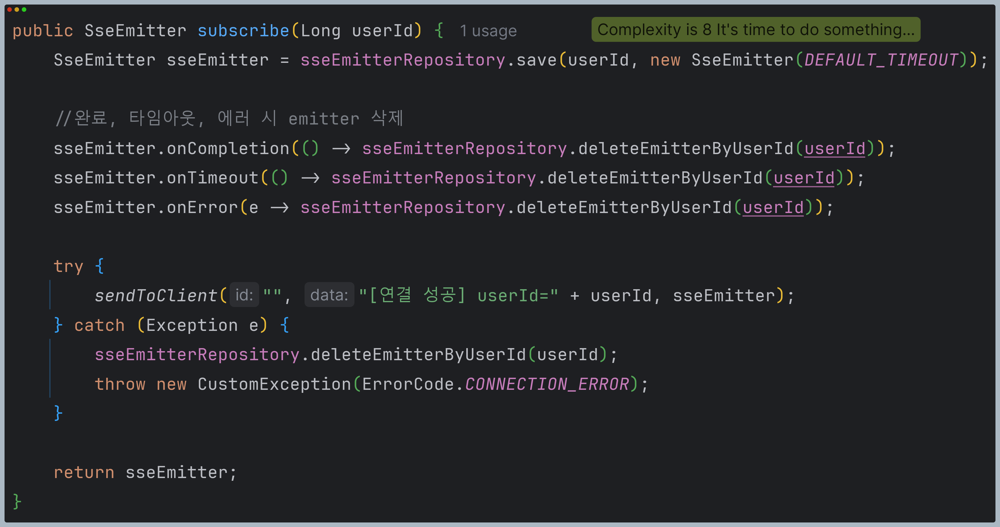

- **알림 구독**

  - thread-safe한 ConcurrentHashMap에 새로운 SseEmitter를 저장합니다.
  - 완료, 타임아웃, 에러 발생 시 Emitter를 삭제합니다.
  - 연결에 성공하면 클라이언트에게 연결이 성공했다는 알림을 전송합니다.
  - 오류가 발생하면 Emitter를 삭제하고, 예외를 발생시킵니다.

<br/>

### 알림 전송

**Controller**

📌 [코드 확인](https://github.com/hbeeni/foodie-server/blob/a5ef93f0bb4f2db668bf56c8f6477c222a582b31/src/main/java/com/been/foodieserver/controller/PostLikeController.java#L25)

- **요청 처리**

  - 좋아요를 누른 유저(=로그인한 유저), 좋아요를 받은 게시글 ID를 요청으로 받습니다.

    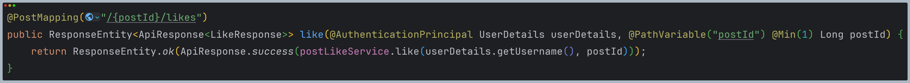

<br/>

**Service & Repository**

📌 [코드 확인](https://github.com/hbeeni/foodie-server/blob/a5ef93f0bb4f2db668bf56c8f6477c222a582b31/src/main/java/com/been/foodieserver/service/PostLikeService.java#L29)

  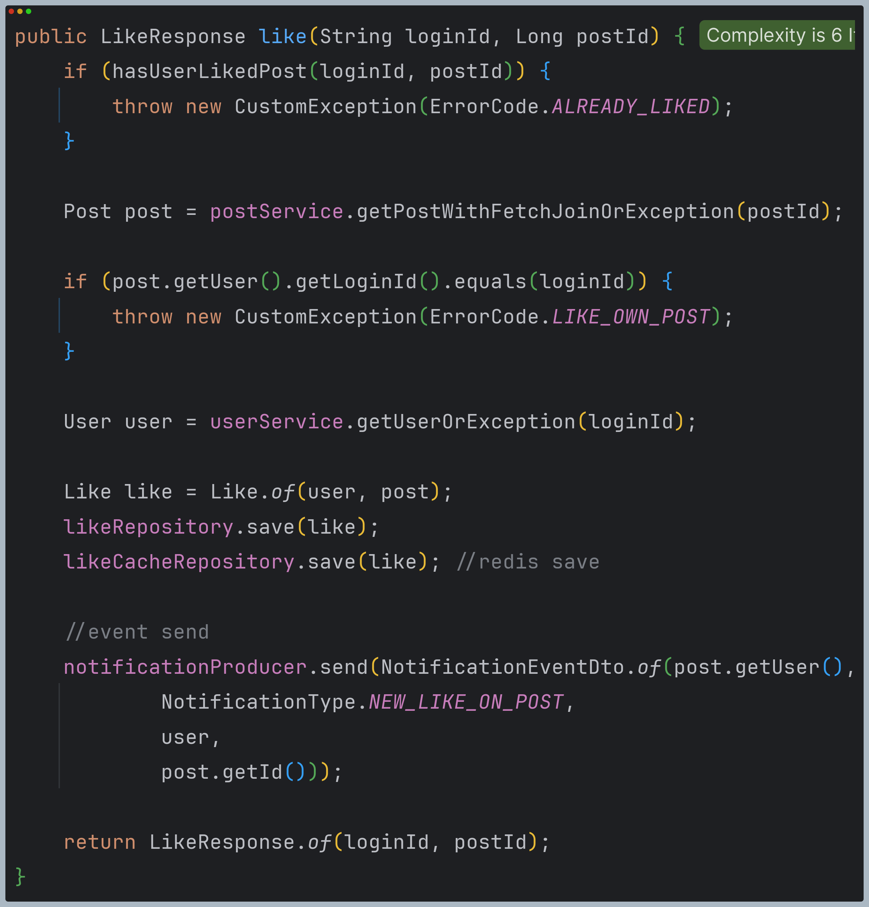

<br/>

1. **예외가 발생하는 경우**

- 본인의 게시글인지 확인하기 위해 DB에서 해당 게시글을 가져옵니다.
- 좋아요를 한 게시글에 또 좋아요를 하거나 본인의 게시글에 좋아요를 하는 경우 예외가 발생합니다.

  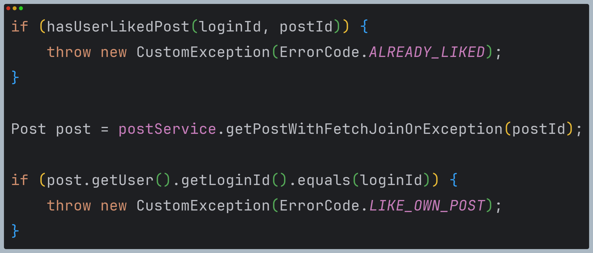

<br/>

2. **DB, Redis에 좋아요 저장**

- DB와 Redis에 좋아요 엔티티를 저장합니다.
- Redis: key가 `post:like:{postId}`인 Set에 좋아요를 누른 유저의 ID를 저장합니다.

  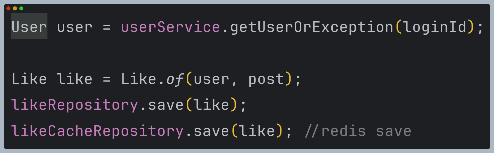

<br/>

3. **Kafka를 이용한 비동기 처리**

- 알림은 Kafka를 사용해서 비동기적으로 전송합니다.
- producer는 notifications 토픽에 알림 이벤트를 발생시킵니다.

  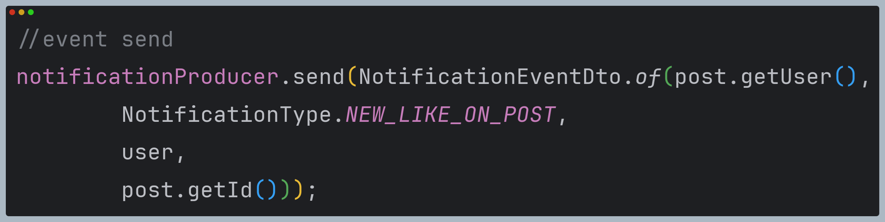

- consumer는 notifications 토픽의 알림 이벤트를 읽습니다. 📌 [코드 확인](https://github.com/hbeeni/foodie-server/blob/a5ef93f0bb4f2db668bf56c8f6477c222a582b31/src/main/java/com/been/foodieserver/consumer/NotificationConsumer.java#L19)

  

- DB에 알림을 저장하고, ConcurrentHashMap에 저장되어 있는 Emitter를 찾아 해당 클라이언트에게 알림을 전송합니다.

  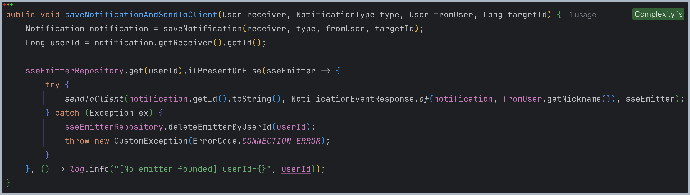

</div>
</details>

<br/>

## 6. 핵심 트러블 슈팅

### 6.1. 게시글 목록 조회 성능 개선

- 게시글 목록 조회 기능은 Foodie의 핵심 기능이기 때문에 성능 테스트를 진행했습니다.
- 테스트 환경: 로컬
  - CPU: 13th Gen Intel(R) Core(TM) i5-1340P (12 core, 16 thread)
  - Memory: 16GB
- 기존 코드(DB에서 데이터 조회)는 100명의 유저만 접속해도 대부분의 요청이 실패해 성능 테스트의 의미가 없었습니다.

```java
public Page<PostResponse> getPostList(int pageNum, int pageSize) {
    Pageable pageable = makePageable(pageNum, pageSize);
    return postRepository.findAll(pageable).map(PostResponse::of);
}
```

<br/>

#### 성능 개선 과정

DB에 접근해 데이터를 가져오는 데 시간이 많이 걸린다고 판단해 Redis에 게시글을 캐싱해 조회 성능을 높이기로 하였습니다.

1. 게시글 작성 시 먼저 DB에 게시글을 저장한 후 Redis에 게시글을 저장하기 위한 이벤트를 Kafka로 발행합니다.

   ```java
   public PostResponse writePost(String loginId, PostDto dto) {
       Category category = getCategoryOrException(dto.getCategoryId());
       User user = userService.getUserOrException(loginId);

       Post savedPost = postRepository.save(dto.toEntity(user, category));
       postProducer.send(savedPost);

       return PostResponse.of(user, category, savedPost);
   }
   ```

2. Kafka consumer는 이벤트를 읽어 Reids에 게시글을 저장합니다.

   ```java
   @KafkaListener(topics = "${spring.kafka.topic.post}", groupId = "post")
   public void consume(Post post, Acknowledgment ack) {
       log.info("[consume the event] postId={}", post.getId());
       postCacheRepository.save(post);
       ack.acknowledge();
   }
   ```

3. 게시글 조회 시 Redis에서 게시글을 가져옵니다. (핵심 기능 - 게시글 목록 조회를 참고해주세요.)

   ```java
   @Transactional(readOnly = true)
   public PageDto<PostResponse> getPostList(int pageNum, int pageSize) {
       return postCacheRepository.findAll(pageNum, pageSize);
   }
   ```

<br/>

#### 성능 개선 결과

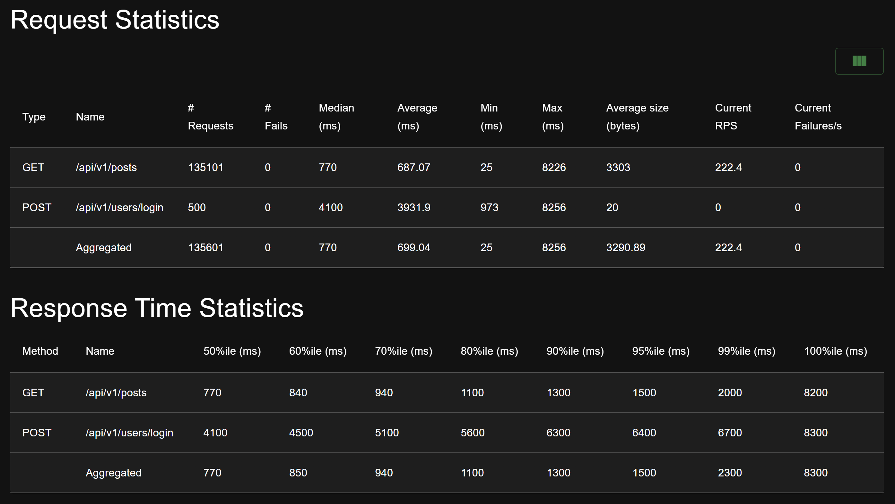
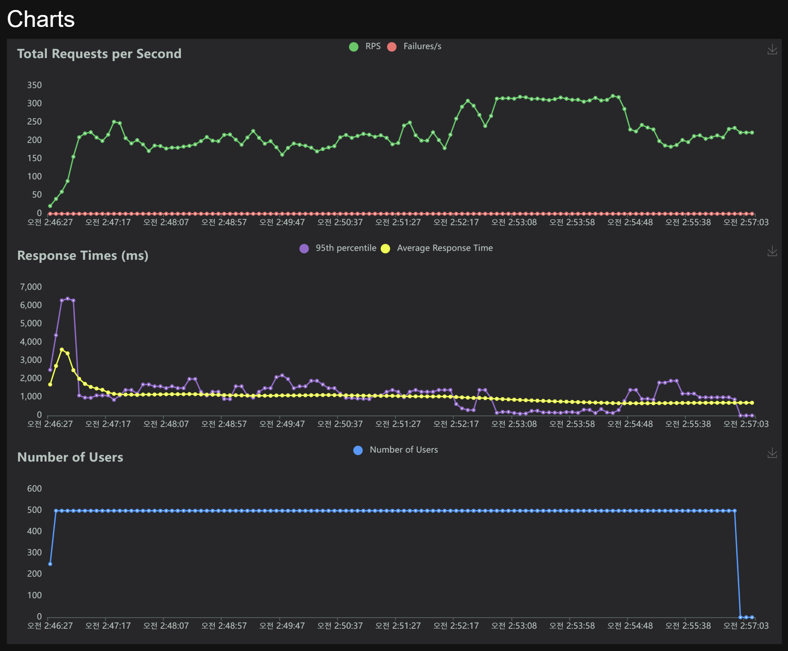

유저 5만명, 게시글 100만개, 댓글 100만개가 존재하는 상황에서 500명의 유저가 접속 시 222.4 TPS를 달성함으로써 성능 개선에 성공했습니다.

<br/>

### 6.2. @DataJpaTest 시 Querydsl Repository 빈은 주입되지 않는 문제

- `@DataJpaTest`는 JPA에 관련된 설정들만 적용시켜주기 때문에 `@Repository`로 등록한 스프링 빈인 `PostQueryRepository`는 주입되지 않아서 오류가 발생했습니다.

<details>
<summary><b>기존 코드</b></summary>
<div markdown="1">

```java
@Import(JpaConfig.class)
@DataJpaTest
class PostQueryRepositoryTest {

    @Autowired
    private PostQueryRepository postQueryRepository;
}
```

</div>
</details>

<br/>

- `@TestConfiguration` + `@Import`를 사용해 `PostQueryRepository` 클래스를 빈으로 직접 등록해주어 문제를 해결하였습니다.

<details>
<summary><b>개선된 코드</b></summary>
<div markdown="1">

```java

@TestConfiguration
public class TestQueryDslConfig {

    @Autowired
    private EntityManager entityManager;

    @Bean
    public JPAQueryFactory jpaQueryFactory() {
        return new JPAQueryFactory(entityManager);
    }

    @Bean
    public PostQueryRepository postQueryRepository() {
        return new PostQueryRepository(jpaQueryFactory());
    }
}
```

```java

@Import({JpaConfig.class, PostQueryRepositoryTest.TestQueryDslConfig.class}) //추가
@DataJpaTest
class PostQueryRepositoryTest {
    //...
}
```

</div>
</details>

<br/>

### 6.3. 통합 테스트를 여러 개 진행 시 DB에 데이터가 남아 있는 문제

- 통합 테스트를 위해 `@SpringBootTest`를 사용하였는데 여러 개의 통합 테스트를 진행하니 `DataIntegrityViolationException` 예외가 발생했습니다.
- 이는 이전의 테스트 진행 후 데이터가 남아 있기 때문에 foreign key constraint을 위배해서 발생한 예외였습니다.
- 해결
  - 이를 해결하려면 각 테스트 전이나 후에 DB에 새로 연결하거나(`@DirtiesContext`) DB를 초기화(`@Sql`)해야 합니다.
  - `@Sql`을 사용하는 것이 테스트 성능은 더 좋지만 테이블이 추가될 때마다 쿼리문도 추가해줘야 하는 단점이 있습니다.
  - 따라서 `@DirtiesContext`를 사용해 DB 연결을 초기화하였습니다.

<details>
<summary><b>개선된 코드</b></summary>
<div markdown="1">

```java

@DirtiesContext(classMode = DirtiesContext.ClassMode.BEFORE_EACH_TEST_METHOD)
@SpringBootTest(webEnvironment = SpringBootTest.WebEnvironment.NONE)
class UserServiceIntegrationTest {
    //...
}
```

```java

@DirtiesContext(classMode = DirtiesContext.ClassMode.BEFORE_EACH_TEST_METHOD)
@SpringBootTest(webEnvironment = SpringBootTest.WebEnvironment.NONE)
class PostServiceIntegrationTest {
    //...
}
```

</div>
</details>

<br/>

## 7. 그 외 트러블 슈팅

<details>
<summary><code>./gradlew: /bin/sh^M: bad interpreter: No such file or directory</code></summary>
<div markdown="1">

- 문제: scp 명령어로 로컬의 파일들을 GCP VM 인스턴스로 전송한 후 빌드했는데 오류가 발생함
- 헤결

  - 로컬(Window) 파일을 VM 인스턴스(Ubuntu)에 그대로 전송했기 때문에 CRLF/LF 개행 문자 차이로 발생한 오류였음
  - 서버 상에서 개행문자를 변경하여 해결함

  ```bash
  $ vi gradlew
  $ :set fileformat=unix
  ```

</div>
</details>

<details>
<summary>응답 시 <code>@LastModifiedDate</code>로 설정한 필드가 업데이트되지 않은 채 반환되는 문제</summary>
<div markdown="1">

- 게시글을 수정하고, 수정한 게시글을 반환할 때 `modifiedAt` 필드가 업데이트 되었지만 응답에는 이전 날짜가 반환되는 문제가 발생함
- flush가 될 때 변경을 감지하는데 flush는 transaction이 커밋될 때 자동으로 호출됨. 응답은 transaction이 커밋되기 전에 생성되기 때문에 발생한 문제였음

  ```java
  public PostResponse modifyPost(String loginId, Long postId, PostDto dto) {
  	Category category = getCategoryOrException(dto.getCategoryId());
  	Post post = getPostByUserOrException(postId, loginId);
  	User user = userService.getUserOrException(loginId);

  	post.modify(category, dto.getTitle(), dto.getContent()); //dirty checking

  	return PostResponse.of(user, category, post); //업데이트 전 날짜가 반환됨
  }
  ```

- 해결: 응답을 생성하기 전에 수동으로 flush를 호출함

  ```java
  public PostResponse modifyPost(String loginId, Long postId, PostDto dto) {
  	Category category = getCategoryOrException(dto.getCategoryId());
  	Post post = getPostByUserOrException(postId, loginId);
  	User user = userService.getUserOrException(loginId);

  	post.modify(category, dto.getTitle(), dto.getContent());

  	postRepository.flush(); //flush 호출

  	return PostResponse.of(user, category, post);
  }
  ```

</div>
</details>

<details>
<summary><code>dial unix /var/run/docker.sock: connect: permission denied</code></summary>
<div markdown="1">

- docker compose를 실행했는데 오류가 발생함
- 해결: /var/run/docker.sock에 권한이 없어서 발생한 오류로 `chmod`를 사용해 모든 계정에 권한을 부여해서 해결함 (보안상 docker group을 사용하는 것이 좋다고 함)

  ```bash
  sudo chmod 666 /var/run/docker.sock
  ```

</div>
</details>

<details>
<summary>Linux에서 host.docker.internal을 인식하지 못하는 문제</summary>
<div markdown="1">

- 아래와 같이 prometheus 설정을 하고 Linux에서 Docker Compose를 실행했는데 `host.docker.internal`을 인식하지 못해 metric을 수집하지 못하는 문제가 발생함

  ```yml
  scrape_configs:
    - job_name: "foodie-server"
      metrics_path: "/actuator/prometheus"
      static_configs:
        - targets: ["host.docker.internal:80"]
  ```

- 해결: `host.docker.internal`은 Mac, Windows에서만 사용할 수 있음. Linux에서 사용하기 위해서는 Docker 실행 시 `--add-host` 옵션을 주거나 Docker
  Compose에 `extra_hosts` 설정을 해줘야 함

  ```bash
  docker run --add-host=host.docker.internal:host-gateway prom/prometheus:latest
  ```

  ```yml
  services:
  foodie-monitoring-prometheus:
    container_name: foodie-monitoring-prometheus
    image: prom/prometheus:latest
    extra_hosts: #추가
      - "host.docker.internal:host-gateway"
  ```

</div>
</details>

<details>
<summary>테스트에서 <code>CustomUserDetails</code> 타입의 인증 객체를 가져오지 못해서 발생한 문제</summary>
<div markdown="1">

- 문제: `CustomUserDetails`가 필요한 Controller 테스트에서 `@WithMockUser`를 사용했더니 `Index 0 out of bounds for length 0` 오류가 발생함

  - `@WithMockUser`를 사용하면 `UserDetails` 객체로만 로그인할 수 있기 때문

  ```java
  @GetMapping
  public ResponseEntity<ApiResponse<List<NotificationResponse>>> getNotificationList(@AuthenticationPrincipal CustomUserDetails userDetails,
  @RequestParam(value = "pageNum", defaultValue = "1") @Min(1) int pageNum,
  @RequestParam(value = "pageSize", defaultValue = "10") @Min(1) int pageSize) {

      return ResponseEntity.ok(ApiResponse.success(notificationService.getNotificationList(userDetails.getId(), pageNum, pageSize))); //id 필요

  }
  ```

  ```java
  @AutoConfigureMockMvc
  @SpringBootTest
  class NotificationControllerTest {

    @WithMockUser
    @DisplayName("요청이 유효하면 알림 목록 조회 성공")
    @Test
    void getNotificationList_IfRequestIsValid() throws Exception {
        //...
    }
  }
  ```

- 해결: `CustomUserDetails` 객체를 얻기
  위해 `@WithUserDetails(value = "receiver", setupBefore = TestExecutionEvent.TEST_EXECUTION)`를 사용함

  - `@BeforeEach`에서 username이 receiver인 `User`를 생성한 후 테스트를 진행하기 위해 `setupBefore = TestExecutionEvent.TEST_EXECUTION`를 설정함

  ```java
  @AutoConfigureMockMvc
  @SpringBootTest
  class NotificationControllerTest {

    @BeforeEach
    void setUp() {
        notificationApi = baseUrl + "/notifications";
        receiver = User.of("receiver", "pwd", "receiver", Role.USER);
        userRepository.save(receiver);
    }

    @WithUserDetails(value = "receiver", setupBefore = TestExecutionEvent.TEST_EXECUTION)
    @DisplayName("요청이 유효하면 알림 목록 조회 성공")
    @Test
    void getNotificationList_IfRequestIsValid() throws Exception {
        //...
    }
  }
  ```

</div>
</details>
